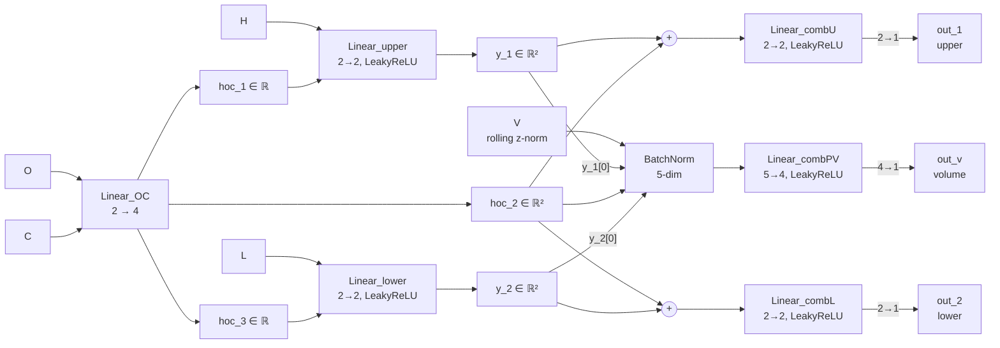

# Architecture - Price Receptor

> 본 문서는 `Architecture.md` 의 보조 설계 문서.
> `Price Receptor` (한 캔들 OHLC 를 고정 차원 임베딩으로 변환하는 입력 처리 layer) 의 설계를 다룬다.
> 본 문서 내 구현 코드 작성 금지. 구조와 책임 경계까지만.
> **초안** — 확정 사항만 기재한다. 미확정은 "미결" 에 모은다.

---

## 1. 모듈 목적

[확정] **Price Receptor** 는 한 자산의 OHLC 캔들 하나를 받아 **2-dim 벡터**로 변환하는 per-candle tokenizer.
NLP 의 word embedding 과 같은 역할: 시퀀스 안에서 파라미터 공유, 각 토큰(캔들)을 독립적으로 임베딩.

[확정] 본 receptor 의 책임 경계:
- 입력: 정규화된 HOCL 4 채널 (정규화는 receptor 외부에서 수행)
- 출력: 2-dim 벡터
- 시퀀스 처리는 책임 외 (척추/backbone 의 영역)
- 거래량 V 는 책임 외 (별도 처리)

---

## 2. 내부 구조

[확정] 3 개 선형층 (활성함수 분포 다양) + 2 개 결합 MLP 로 구성된 candle-aware tokenizer.
비대칭 routing 으로 OC 본연의 특성과 H/L 의 wick 정보를 분리해서 추출하는 inductive bias.

[확정] **`Linear_OC` 는 단순 선형층** (활성함수 없음). 입력에 가까운 단계에서 활성함수 게이팅이
정보의 절반(음수 영역)을 차단하는 위험을 피한다. 비선형성은 이후 단계에서 공급.

[확정] **모든 활성함수는 LeakyReLU** (기본 slope=0.01). 사전 실험에서 ReLU 사용 시 Linear_lower 경로
dead neuron 문제 (pre-activation 항상 음수 → 영구 0 출력) 발견. LeakyReLU 로 음수 입력에도 작은 기울기
유지하여 gradient 흐름 보장.

[확정] **`Linear_upper`, `Linear_lower` 는 선형층 + LeakyReLU**. 단일 노드 scalar 대신 2 차원 벡터
($y_1, y_2 \in \mathbb{R}^2$) 로 표현력 확장. 차원은 hyperparameter `side_dim` (기본 2).

[확정] **`hoc_2` 도 $\mathbb{R}^2$ 벡터** (side_dim 과 동일). Linear_OC 출력은 $1 + 2 + 1 = 4$ 차원으로 분할:
$hoc_1$ (scalar), $hoc_2$ (2-vector), $hoc_3$ (scalar). 단일 scalar 로 공통 특성을 표현하기엔 부족하다는 판단.

[확정] **out_1, out_2 결합은 element-wise addition**: $out_1 = \text{MLP\_combU}(y_1 + hoc_2)$,
$out_2 = \text{MLP\_combL}(y_2 + hoc_2)$. concat 이 아닌 덧셈을 쓰는 이유:
- $hoc_2$ 가 양쪽 출력에 같은 신호로 더해짐 → 구조적으로 공통 baseline 의미 강제
- $y_1, y_2$ 는 그 baseline 으로부터의 deviation 으로 자연 해석
- 학습 신호 없이 구조 자체가 hoc_2 의 "공통" 역할을 보장

[확정] **out_v 결합은 concat**: $out_v = \text{MLP\_combPV}(y_1[0], hoc_2, y_2[0], V)$.
- $y_1, y_2$ 의 **첫 노드만** 입력으로 사용 — 그 노드들만 volume 학습 신호를 받음 → 자동 specialization
- $y_1[0], y_2[0]$ 는 "volume 과 결합되는 wick feature"
- $y_1[1], y_2[1]$ 는 "pure price wick feature" (volume 무관)
- $hoc_2$ 전체는 양쪽 그대로 사용
- $V$ 는 외부에서 log + 표준화 처리된 scalar

[확정] **OC 단방향 경로**: $H, L$ 은 OC 처리 그래프에 의존하지 않음. 캔들 내부 부등식
$H \geq \max(O,C) \geq \min(O,C) \geq L$ 의 구조적 비대칭을 그래프에 새김.

[확정] **out_1, out_2, out_v 는 동등 위치의 3 출력 채널**. 각각 upper-aspect, lower-aspect,
volume-aspect 의미. 척추 backbone 이 셋을 모두 활용.

[확정] **Linear_OC 의 rank 제약**: 입력이 2-dim 이므로 출력 4 개는
$(O, C)$ 평면의 affine 조합 — rank ≤ 2. 채널들은 선형 종속이지만 서로 다른 view 를 제공하며,
downstream 비선형 결합에서 활용된다.

---

## 3. 학습 가능 모듈

[확정] 명명된 layer 6 개 + 각 명명 layer 뒤 unnamed 최종 projection (scalar 출력용).

| 모듈 | 구조 | 입력 → 출력 | 의미 |
|---|---|---|---|
| `Linear_OC` | `Linear(2, 4)` (선형, LeakyReLU 없음) | $\mathbb{R}^2 \to \mathbb{R}^4$ | OC 에서 $hoc_1$ (1), $hoc_2$ (2), $hoc_3$ (1) 추출 |
| `Linear_upper` | `Linear(2, 2) + LeakyReLU` | $\mathbb{R}^2 \to \mathbb{R}^2$ | $H$ 와 $hoc_1$ 결합 → $y_1$ |
| `Linear_lower` | `Linear(2, 2) + LeakyReLU` | $\mathbb{R}^2 \to \mathbb{R}^2$ | $L$ 과 $hoc_3$ 결합 → $y_2$ |
| `Linear_combU` | `Linear(2, 2) + LeakyReLU` | $\mathbb{R}^2 \to \mathbb{R}^2$ | $y_1 + hoc_2$ 처리 (hidden) |
| `Linear_combL` | `Linear(2, 2) + LeakyReLU` | $\mathbb{R}^2 \to \mathbb{R}^2$ | $y_2 + hoc_2$ 처리 (hidden) |
| `Linear_combPV` | `Linear(5, 4) + LeakyReLU` | $\mathbb{R}^5 \to \mathbb{R}^4$ | $y_1[0], hoc_2, y_2[0], V$ 처리 (hidden) |
| (unnamed) `Linear(2, 1)` | 선형 | $\mathbb{R}^2 \to \mathbb{R}$ | combU → $out_1$ scalar 압축 |
| (unnamed) `Linear(2, 1)` | 선형 | $\mathbb{R}^2 \to \mathbb{R}$ | combL → $out_2$ scalar 압축 |
| (unnamed) `Linear(4, 1)` | 선형 | $\mathbb{R}^4 \to \mathbb{R}$ | combPV → $out_v$ scalar 압축 |

[확정] Hyperparameters:
- `side_dim` (기본 2): $hoc_2, y_1, y_2$ 의 차원
- `hidden` (기본 2): `Linear_combU/combL` 의 hidden 차원
- `hidden_v` (기본 4): `Linear_combPV` 의 hidden 차원

[확정] 기본값 기준 총 파라미터 약 71.

[추측] **명명 vs unnamed 구분 의도**: 명명 layer 는 의미 있는 표현 학습 (Linear + LeakyReLU 로 비선형 변환).
Unnamed 최종 projection 은 단순 scalar 압축 — architecture 의 표현력 핵심이 아님. 다이어그램에서 노드 없이 edge 로만 표시.

---

## 4. 외부 인터페이스

[확정] **입력 텐서**: shape `(..., 4)`. 마지막 dim 순서 `[H, O, C, L]`. 정규화된 값.
[확정] **출력 텐서**: shape `(..., 2)`. 마지막 dim 순서 `[out_1, out_2]`.

[확정] 시퀀스 차원이 앞에 붙어도 동일 처리 — broadcasting. 윈도우 $n$ 개 캔들 → `(n, 4)` → `(n, 2)`.

[확정] **파라미터 공유**: 동일 receptor 인스턴스가 윈도우 모든 시점에 적용됨. 시점 정보는 receptor 가 알지 않음.

---

## 5. 입력 정규화 (외부 책임)

[확정] receptor 는 정규화된 입력을 가정. 정규화 자체는 receptor 외부 모듈의 책임 (별도 layer 또는 데이터 파이프라인).

[확정] 정규화 방향 (확정됨):
1. **log 변환** — 각 채널, 각 캔들에 $\log$ 적용 (단조 변환, 캔들 내부 부등식 보존)
2. **위치 제거** — 윈도우 마지막 캔들 close $C_n$ 기준으로 차감
   $$\tilde{x}_{i,k} = \log(x_{i,k}) - \log(C_n) = \log(x_{i,k} / C_n)$$

[확정] 이 변환의 성질:
- 절대 가격 레벨 제거 (자산간 무관)
- 캔들 내부 부등식 보존 ($\tilde H \geq \max(\tilde O, \tilde C) \geq \min(\tilde O, \tilde C) \geq \tilde L$)
- 캔들간 상대 위치 보존
- $c_n$ 의 close 는 항상 0 (anchor)
- 시점 인덱스 정보 무관 (윈도우 순서에 자연스럽게 박혀 있음)

[확정] 위치별 출력 의미의 자연 분화 (파라미터 공유에도 불구):
- $i = n$ (가장 최근): $\tilde C = 0$ 항상 → 출력은 캔들 모양 (shape) 만 인코딩
- $i < n$: $\tilde C = \log(C_i / C_n)$ → 출력은 그 캔들의 shape + 현재 대비 위치 인코딩

---

## 6. 출력 의미

[확정] 2-dim 출력 의도된 의미:
- $out_1$ → upper-aspect (캔들의 상단 측 압력·정보)
- $out_2$ → lower-aspect (캔들의 하단 측 압력·정보)

[확정] **단, 구조만으로는 이 의미가 자동 보장되지 않음**. 학습 신호에 따라 분해 방향이 달라짐:

| 학습 신호 | 실측 분해 방향 |
|---|---|
| Autoencoder loss only | body × wick (자생적, 의도와 다름) |
| Autoencoder + aux upper/lower loss ($\lambda \approx 0.1$) | upper × lower (의도 달성) |
| Forecasting loss + backbone | task 의존 |

[추측] 의도된 의미 분해가 필요하면 auxiliary supervision 필요. 단순히 "잘 압축된 표현" 이 목적이면 autoencoder 만으로 충분.

[근거] `.meta/260528-캔들receptor검증결과.md` 1차 검증 결과.

---

## 7. 거래량 통합

[확정] 본 receptor 는 거래량 V 를 다루지 않음. V 는 가격과 분포·통계가 완전히 다르므로 별도 처리.

[추측] 사용자 의견: V 는 log + 표준화 → sigma 값을 그대로 입력으로 사용하면 충분.

[추적필요] V 와 price receptor 출력의 결합 위치 — 척추 입력 단? receptor 출력 옆? 별도 sub-receptor? 미정 (§9 참조).

---

## 8. 하위 구성 (없음)

[확정] receptor 는 leaf 모듈. 자체 하위 구조 없음. 5 개 sub-MLP 는 내부 구현 디테일이지 별도 모듈 아님.

---

## 9. 미결

- **스케일 정규화 방식** — log + reference 차감만으로는 자산·기간별 변동성 차이 미해결. 후보:
  - 윈도우 log-range 로 나눔
  - EWMA volatility 로 나눔
  - RevIN 류 학습형 정규화
  단일 자산 학습이면 생략 가능성도 있음.
- **거래량 V 통합 방식** — 척추 concat / 별도 sub-receptor / gating 신호 / 정규화 결합 중 선택.
- **출력 차원 2 의 적정성** — 의도된 의미 분해를 포기하고 더 넓은 임베딩(예: 8, 16, 32)으로 갈지 검토 가능.
- **학습 paradigm** — 다음 단계 사용 목적(forecasting / classification / contrastive 등)에 따라 선택.
- **실제 OHLC 데이터에서의 검증** — 합성 캔들 검증만 완료. 실제 시장 데이터 generalization 미확인.
- **시간 해상도별 적정성** — 일봉/분봉/틱마다 적정 hyperparameter 가 다를 수 있음.
- **canonical pattern 외 추가 검증** — Long-Legged Doji 등 일부 패턴은 의도 분해와 다른 위치에 떨어졌음. 의미 해석 필요.

---

## 10. 참조

- 검증 결과: `.meta/260528-캔들receptor검증결과.md`
- 검증 연구 계획: `.meta/260528-캔들receptor분리도검증연구계획.md`
- 모태 조사: `.meta/260527-가격거래량전용네트워크.md`
- 비교 대상 (DAIN/RevIN/FAN): `.meta/260527-가격전용정규화레이어개관.md`
- 구현 (참조용): `experiments/receptor_verification/receptor.py`
