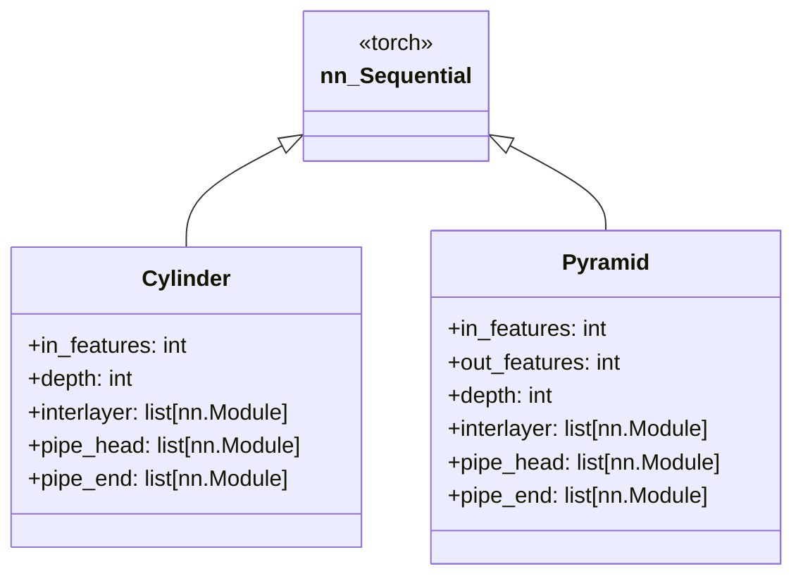

# NNPipeline Architecture

## 개요

자주 쓰는 1D MLP 형상을 미리 정의해 둔 프리셋 라이브러리.
각 프리셋은 `nn.Sequential`의 서브클래스로, 인스턴스를 만들면 곧바로 torch 네트워크 객체가 된다.
활성함수/정규화/드롭아웃 등 사이에 끼우는 모듈은 사용자가 직접 인스턴스로 넘겨주고, 라이브러리는 deepcopy해서 사이사이에 끼운다.

## 컴포넌트

```mermaid
classDiagram
    class nn_Sequential {
        <<torch>>
    }

    class Cylinder {
        +in_features: int
        +depth: int
        +interlayer: list[nn.Module]
        +pipe_head: list[nn.Module]
        +pipe_end: list[nn.Module]
    }

    class Pyramid {
        +in_features: int
        +out_features: int
        +depth: int
        +interlayer: list[nn.Module]
        +pipe_head: list[nn.Module]
        +pipe_end: list[nn.Module]
    }

    nn_Sequential <|-- Cylinder
    nn_Sequential <|-- Pyramid
```

## 조립 방식

```mermaid
flowchart LR
    H[pipe_head] --> L1[Linear]
    L1 --> I1[interlayer]
    I1 --> L2[Linear]
    L2 --> I2[interlayer]
    I2 --> Ln[... Linear]
    Ln --> E[pipe_end]
```

- `interlayer`는 Linear 사이에만 끼우고 마지막 Linear 뒤에는 붙지 않는다.
- `pipe_head`, `pipe_end`는 각각 맨 앞, 맨 뒤에 한 번씩 붙는다.
- 모든 입력 모듈은 deepcopy되어 들어가므로 외부에서 동일 인스턴스를 여러 번 넘겨도 독립적으로 동작한다.
