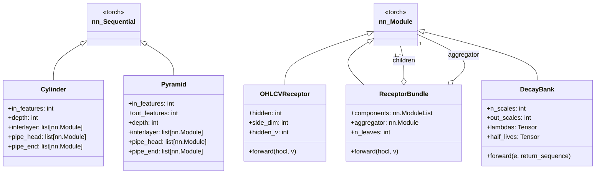
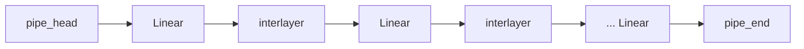

# NNPipeline Architecture

## 개요

자주 쓰는 1D MLP 형상 프리셋 + 가격 시계열 도메인 receptor / receptor bundle 컨테이너 모음.

- MLP 프리셋 (`Cylinder`, `Pyramid`) 은 `nn.Sequential` 서브클래스로, 인스턴스를 만들면 곧바로 torch 네트워크 객체가 된다.
  활성함수/정규화/드롭아웃 등 사이에 끼우는 모듈은 사용자가 직접 인스턴스로 넘겨주고, 라이브러리는 deepcopy 해서 사이사이에 끼운다.
- Receptor (`OHLCVReceptor`) 는 한 캔들(OHLC + V) 을 고정 차원 임베딩으로 변환하는 per-candle tokenizer.
- Receptor Bundle (`ReceptorBundle`) 은 receptor 또는 다른 bundle 을 자식 노드로 묶는 composite 컨테이너로,
  multi-resolution candle hierarchy 의 한 단계를 표현한다.
- Decay Bank (`DecayBank`) 는 임베딩 시퀀스를 다중 시간스케일 지수 감쇠 상태로 누적하는 척추 모듈.
  recency bias 와 모멘텀 감쇠 신호 (fast-slow 차이) 를 구조로 보장한다. 설계: `Architecture - Decay Bank.md`.

## 컴포넌트

```mermaid
classDiagram
    class nn_Sequential {
        <<torch>>
    }
    class nn_Module {
        <<torch>>
    }

    class Cylinder {
        +in_features: int
        +depth: int
        +interlayer: list[nn.Module]
        +pipe_head: list[nn.Module]
        +pipe_end: list[nn.Module]
    }

    class Pyramid {
        +in_features: int
        +out_features: int
        +depth: int
        +interlayer: list[nn.Module]
        +pipe_head: list[nn.Module]
        +pipe_end: list[nn.Module]
    }

    class OHLCVReceptor {
        +hidden: int
        +side_dim: int
        +hidden_v: int
        +forward(hocl, v)
    }

    class ReceptorBundle {
        +components: nn.ModuleList
        +aggregator: nn.Module
        +n_leaves: int
        +forward(hocl, v)
    }

    class DecayBank {
        +n_scales: int
        +out_scales: int
        +lambdas: Tensor
        +half_lives: Tensor
        +forward(e, return_sequence)
    }

    nn_Sequential <|-- Cylinder
    nn_Sequential <|-- Pyramid
    nn_Module <|-- OHLCVReceptor
    nn_Module <|-- ReceptorBundle
    nn_Module <|-- DecayBank
    ReceptorBundle o-- "1..*" nn_Module : children
    ReceptorBundle o-- "1" nn_Module : aggregator
```

## 조립 방식

```mermaid
flowchart LR
    H[pipe_head] --> L1[Linear]
    L1 --> I1[interlayer]
    I1 --> L2[Linear]
    L2 --> I2[interlayer]
    I2 --> Ln[... Linear]
    Ln --> E[pipe_end]
```

- `interlayer`는 Linear 사이에만 끼우고 마지막 Linear 뒤에는 붙지 않는다.
- `pipe_head`, `pipe_end`는 각각 맨 앞, 맨 뒤에 한 번씩 붙는다.
- 모든 입력 모듈은 deepcopy되어 들어가므로 외부에서 동일 인스턴스를 여러 번 넘겨도 독립적으로 동작한다.
