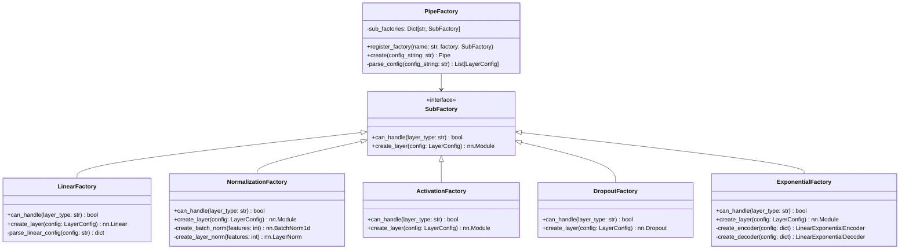

# NNPipeline Architecture

## 개요
동적 네트워크 구성을 위한 기반 패키지로, Fluent Builder Pattern과 Factory Pattern을 조합하여 설정과 구현을 분리한 구조

## 전체 시스템 구조

## 핵심 컴포넌트

### 1. PipeBuilder (Fluent Interface)

### 2. Factory 계층 구조

### 3. 설정 문자열 파싱 구조

## 데이터 흐름

## 확장성 설계

### 새로운 레이어 타입 추가 방법
1. 새로운 SubFactory 구현
2. PipeBuilder에 해당 메소드 추가
3. PipeFactory에 SubFactory 등록
4. 파싱 규칙 정의

### 설정 문자열 형식
- 기본 형태: `layer_type(param1->param2, param3=value)`
- 구분자: `|` (파이프)
- 파라미터: `()` 내부에 정의
- 예시: `linear(784->256)|batch_norm|relu|dropout(0.3)`
